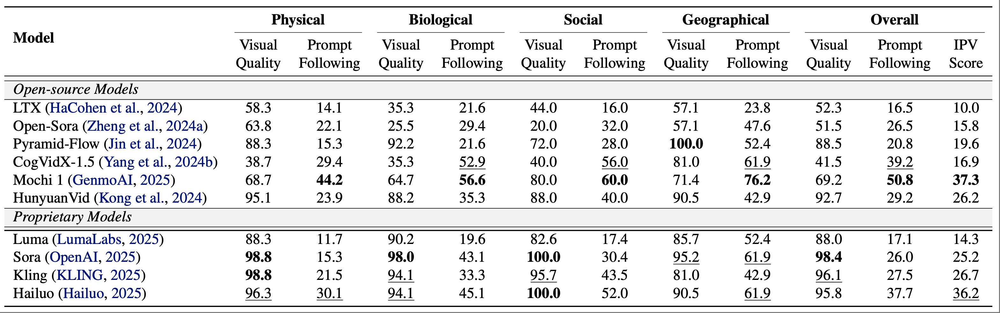
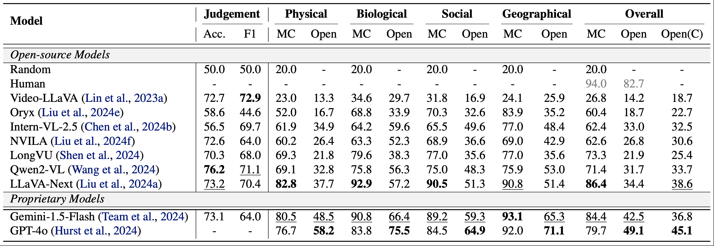

<div align="center">
<h1>Impossible Videos</h1>

[Zechen Bai](https://www.baizechen.site/) <sup>\*</sup>&nbsp;
[Hai Ci](https://haici.cc/) <sup>\*</sup>&nbsp;
[Mike Zheng Shou](https://sites.google.com/view/showlab) <sup></sup>&nbsp;


[Show Lab, National University of Singapore](https://sites.google.com/view/showlab/home?authuser=0) &nbsp;
 
[](https://arxiv.org/abs/2503.14378)
[](https://showlab.github.io/Impossible-Videos/)
[](https://huggingface.co/datasets/showlab/ImpossibleVideos)

<p align="center">
  
</p>

</div>


### News
* **[2025-03-19]** We release the paper on [arXiv](https://arxiv.org/abs/2503.14378)!
* **[2025-03-18]** We release the data and example evaluation code!

## 🤔 What are impossible videos?

Impossible videos refer to videos displaying **counterfactual and anti-reality** scenes that are **impossible** in real world.
We show some video examples below.
Please visit our [website](https://showlab.github.io/Impossible-Videos/) to find more examples.

<video src="https://github.com/user-attachments/assets/a06af093-0e6c-4da9-8a99-1eea73d099b8" width="720"></video>

## 💡 Why we interested in impossible videos?
Impossible videos can be a touch stone for advanced video models.
As an ***out-of-real-world-distribution*** data, it requires the model to not simply ***memorize*** real-world data and ***retrieve*** similar information based on the input, but to genuinely ***learn*** from real-world data and ***reason*** upon the input.

This project aims to advance video research by answering the follow important questions:

- Can today's video generation models effectively follow prompts to **generate** impossible video content?
- Are today's video understanding models good enough for **understanding** impossible videos?

## 🔥 IPV-Bench
we introduce ***IPV-Bench***, a novel benchmark designed to evaluate and foster progress in video understanding and generation.

<p align="center"> </p>

1. **§IPV Taxonomy**: IPV-Bench is underpinned by a comprehensive taxonomy, encompassing 4 domains, 14 categories. It features diverse scenes that defy physical, biological, geographical, or social laws.
2. **§IPV-Txt Prompt Suite**: A prompt suite is constructed based on the taxonomy to evaluate video generation models, challenging their prompt following and creativity capabilities.
3. **§IPV-Vid Videos**: A video benchmark is curated to assess Video-LLMs on their ability of understanding impossible videos, which particularly requires reasoning on temporal dynamics and world knowledge.

## 🏆 Leaderboard

### Text-to-video Generation
<p align="center"> </p>

### Video-LLM-based Video Understanding
<p align="center"> </p>

## 🚀 Get Started

First, go to [Huggingface](https://huggingface.co/ShowLab) and download our data and code, including videos, task files, and example evaluation code.
The task files and examples files can also be found in this GitHub repo.

### Evaluate Impossible Video Generation

1. Use `example_read_prompt.py` to read the `ipv_txt_prompt_suite.json` file to get the text prompts.
2. Use the text prompt to generate videos using your models.
3. Annotate the `visual quality` and `prompt following` fields for each video.
4. Compute `IPV Score` by stating the percentage of videos that are *both of high quality and good prompt following.*

🛠️ **In this study, we employ human annotation to provide reliable insights for the models.
We are still polishing on an automatic evaluation framework, which will be open-sourced in the future.**

### Evaluate Impossible Video Understanding
1. The benchmark involves three tasks: Judgement, Multi-choice QA, and Open-ended QA.
2. Navigate to [example_eval/eval_judgement.py](example_eval/eval_judgement.py), [example_eval/eval_mcqa.py](example_eval/eval_mcqa.py), and [example_eval/eval_openqa.py](example_eval/eval_openqa.py) for each task.
3. The example code implements the full evaluation pipeline. To evaluate your model, you simply modify the `inference_one()` function to produce the output.

### Join Discussion
Welcome to discuss with us and continuously improve the quality of impossible videos.
Reach us with the WeChat QR code below!

<p align="center">

</p>

## 🎓 BibTeX
If you find our work helpful, please kindly star this repo and consider citing our paper.

```
@misc{bai2025impossible,
      title={Impossible Videos}, 
      author={Zechen Bai and Hai Ci and Mike Zheng Shou},
      year={2025},
      eprint={2503.14378},
      archivePrefix={arXiv},
      primaryClass={cs.CV},
      url={https://arxiv.org/abs/2503.14378}, 
}
```
